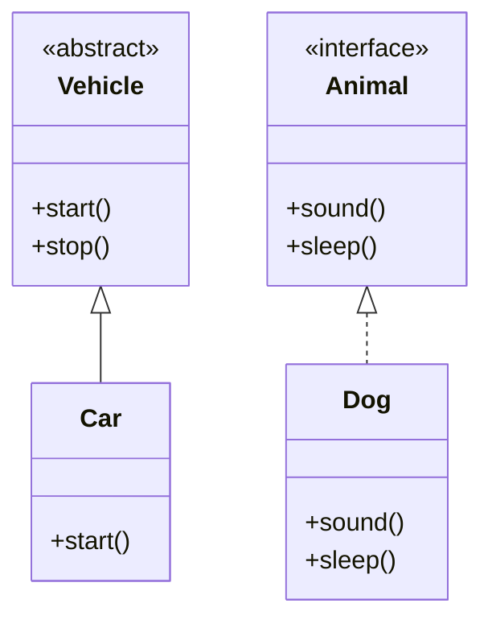

# 🏛️ Abstraction in Java

---

## 📖 Introduction

**Abstraction** is an **OOP concept** that focuses on **hiding implementation details** and showing only **essential features** to the user.
It helps in reducing complexity and **increasing efficiency**.

**In Java, abstraction is achieved by:**

1. **Abstract Classes**
2. **Interfaces**

---

## ✅ Key Points

* Abstract classes can have **both abstract and non-abstract methods**.
* Interfaces contain **only abstract methods** (before Java 8) and constants.
* Abstraction allows **you to focus on what an object does instead of how it does it**.
* Cannot create an object of **abstract class** or **interface** directly.
* A subclass **must implement all abstract methods** of its abstract superclass or interface.

---

## 📝 Example 1: Abstract Class

```java
abstract class Vehicle {
    abstract void start();  // abstract method

    void stop() {           // non-abstract method
        System.out.println("Vehicle stopped");
    }
}

class Car extends Vehicle {
    @Override
    void start() {
        System.out.println("Car started");
    }
}

public class AbstractClassDemo {
    public static void main(String[] args) {
        Vehicle v = new Car(); // Upcasting
        v.start();
        v.stop();
    }
}
```

### Output

```
Car started
Vehicle stopped
```

---

## 📝 Example 2: Interface

```java
interface Animal {
    void sound();
    void sleep();
}

class Dog implements Animal {
    public void sound() {
        System.out.println("Dog barks");
    }
    public void sleep() {
        System.out.println("Dog sleeps");
    }
}

public class InterfaceDemo {
    public static void main(String[] args) {
        Animal a = new Dog(); // Upcasting
        a.sound();
        a.sleep();
    }
}
```

### Output

```
Dog barks
Dog sleeps
```

---

## 🖼 Diagram: Abstraction (Abstract Class & Interface)



---

## 🔑 Why Use Abstraction?

* Hides complex implementation details.
* Focuses on **what the object does** rather than **how it does it**.
* **Reduces code complexity**.
* Promotes **loose coupling** and **enhances maintainability**.
* Supports **multiple implementations** via abstract classes or interfaces.

---

## ⚠️ Important Notes

* Cannot instantiate **abstract classes** or **interfaces**.
* Abstract class can have **constructors**, interfaces cannot (only static blocks or default methods in Java 8+).
* **Upcasting** can be used to refer to objects via abstract class or interface reference.
* Supports **runtime polymorphism**.

---

## 💡 Interview Questions

**1. What is abstraction in Java?**
Abstraction is the process of **hiding implementation details** and showing only the **essential features** of an object.

**2. How is abstraction achieved in Java?**
Using **abstract classes** and **interfaces**.

**3. Can we create an object of abstract class or interface?**
❌ No, but we can **use references** of abstract class or interface for upcasting.

**4. Difference between abstract class and interface?**

* Abstract class → can have abstract + non-abstract methods, constructors, and variables.
* Interface → only abstract methods (before Java 8), constants; no constructors.

**5. What is the use of upcasting in abstraction?**
It allows **abstract class or interface references** to point to subclass objects, enabling **runtime polymorphism**.

**6. Can an abstract class implement an interface?**
✅ Yes, it can, but the abstract class may choose to **implement methods or leave them abstract**.

**7. Can we have a constructor in abstract class?**
✅ Yes, constructors in abstract classes are used for **initializing fields when subclass objects are created**.

**8. Why is abstraction important?**

* Reduces **complexity**
* Improves **maintainability**
* Enables **loose coupling**
* Supports **multiple implementations**
