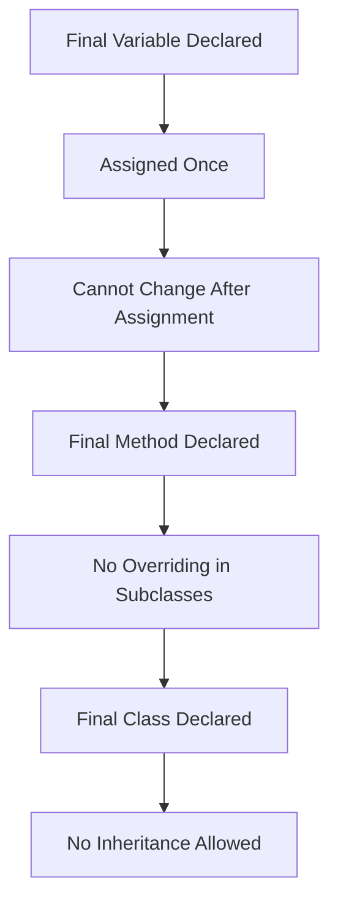

# 🔒 Mastering `final` in Java

---

## 📖 Introduction
The **`final` keyword** in Java is used to declare **constants, prevent method overriding, and stop inheritance**.  
- It can be applied to **variables, methods, and classes**.  
- Ensures **immutability, stability, and safety** in code.

---

## 🔑 Final Variables (Fields)

### ✅ Definition
- Once assigned, the value **cannot be changed**.  
- Makes the variable **constant**.  

### 📌 Example
```java
class Test {
    final int speedLimit = 90;

    void run() {
        // speedLimit = 120; // ❌ Compile-time error
        System.out.println("Speed limit: " + speedLimit);
    }
}
````

### 📝 Rules

1. Must be initialized **once**.
2. Can be initialized:

   * At declaration
   * In **constructor**
   * In **instance block**

```java
class Bike {
    final int speed;

    Bike(int s) {
        speed = s; // initialized via constructor
    }
}
```

3. If `final` + `static` → constant (e.g., `PI`).

---

## 🔑 Final Methods

### ✅ Definition

* A method declared as `final` **cannot be overridden** in subclasses.
* Prevents altering critical behavior.

### 📌 Example

```java
class Vehicle {
    final void start() {
        System.out.println("Vehicle started");
    }
}

class Car extends Vehicle {
    // void start() { } // ❌ Compile-time error
}
```

---

## 🔑 Final Classes

### ✅ Definition

* A class declared as `final` **cannot be extended**.
* Prevents inheritance.

### 📌 Example

```java
final class Animal {
    void sound() {
        System.out.println("Generic sound");
    }
}

// class Dog extends Animal { } // ❌ Error: cannot inherit from final
```

📌 Real-world example:

* `String` class in Java is **final** → ensures immutability and security.

---

## 🗂️ Memory & Lifecycle of `final`



---

## 🎯 Real-World Usage of `final`

1. **Constants**

   ```java
   static final double PI = 3.14159;
   ```

2. **Immutable Classes**

   * `String` class is final → cannot be subclassed.

3. **Security**

   * Prevent overriding sensitive methods like `hashCode()` in core classes.

4. **Thread-Safety**

   * `final` fields ensure safe publication in multi-threaded code.

---

## 📝 Best Practices

* Use `final` for **constants** (with `static`).
* Use `final` methods when overriding could cause **security or logic issues**.
* Mark utility classes as `final` + `private constructor` to prevent inheritance & instantiation.

---

## 🎯 Interview Q\&A

**Q1. What is the difference between `final`, `finally`, and `finalize`?**
**A1.**

* `final` → keyword (variables, methods, classes).
* `finally` → block used in exception handling.
* `finalize()` → method called by GC before object destruction.

---

**Q2. Can we make a constructor `final`?**
**A2.** No. Constructors are never inherited, so marking them `final` has no meaning.

---

**Q3. Why is `String` class final in Java?**
**A3.**

* To ensure immutability.
* For security (e.g., classpath, network addresses).
* For performance (string pool caching).

---

**Q4. Can final variables be initialized later?**
**A4.** Yes, but only once → in **constructor** or **instance block**.

---

**Q5. Can a final method be overloaded?**
**A5.** Yes. `final` prevents overriding, not overloading.

---

## 🧩 Tricky Interview Questions

**Q1. Output?**

```java
class Test {
    final int x;

    Test() {
        x = 10;
    }

    public static void main(String[] args) {
        Test t = new Test();
        // t.x = 20; ❌ Error
        System.out.println(t.x);
    }
}
```

✅ Output: `10`

---

**Q2. Output?**

```java
class A {
    final void show() {
        System.out.println("A");
    }
}

class B extends A {
    void show(int x) {
        System.out.println("B");
    }
}

public class Test {
    public static void main(String[] args) {
        B obj = new B();
        obj.show();    // A
        obj.show(5);   // B
    }
}
```

✅ Final method can’t be overridden but **can be overloaded**.

---

**Q3. Can a final class have mutable fields?**
✅ Yes, but immutability is not guaranteed unless fields are also final.

```java
final class Person {
    String name; // mutable field
}
```

---

```

```
