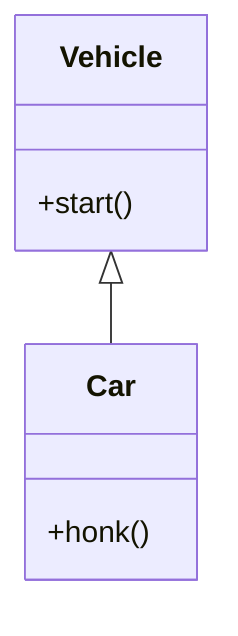
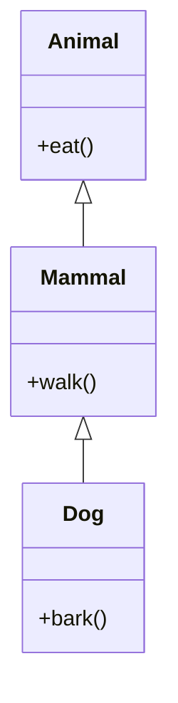

# 🌳 Inheritance in Java

---

## 📖 Introduction

**Inheritance** is a core **OOP concept** in Java.  
It allows a class to **inherit properties and behaviors (fields and methods) from another class**.  

- The class which **inherits** is called the **subclass (child class)**.  
- The class which **is inherited from** is called the **superclass (parent class)**.  
- Inheritance promotes **code reusability** and **modularity**.

---

## ✅ Key Points

- **Single Inheritance:** A class inherits from one class.  
- **Multilevel Inheritance:** A class inherits from a class which is already a subclass.  
- **Hierarchical Inheritance:** Multiple subclasses inherit from one superclass.  
- **Multiple Inheritance (via interfaces in Java):** Java does not support multiple inheritance with classes to avoid ambiguity.  

**Keywords:**
- `extends` → used to inherit a class.  
- `super` → refers to the parent class object.  

---

## 🖼 Diagram: Single Inheritance (Mermaid)




---

## 📝 Example Code: Single Inheritance

```java
// Parent class
class Vehicle {
    void start() {
        System.out.println("Vehicle is starting");
    }
}

// Child class
class Car extends Vehicle {
    void honk() {
        System.out.println("Car is honking");
    }
}

public class InheritanceDemo {
    public static void main(String[] args) {
        Car car = new Car();

        car.start(); // inherited method
        car.honk();  // child method
    }
}
```
**Output:**
- Vehicle is starting
- Car is honking

---

## 🖼 Diagram: Single Inheritance (Mermaid)


# 🌳 Multilevel Inheritance in Java

## 📝 Example Code

```java
class Animal {
    void eat() {
        System.out.println("Animal is eating");
    }
}

class Mammal extends Animal {
    void walk() {
        System.out.println("Mammal is walking");
    }
}

class Dog extends Mammal {
    void bark() {
        System.out.println("Dog is barking");
    }
}

public class MultilevelDemo {
    public static void main(String[] args) {
        Dog d = new Dog();
        d.eat();   // Animal method
        d.walk();  // Mammal method
        d.bark();  // Dog method
    }
}
```

# 💡 Inheritance - Interview Questions

---

**1. What is inheritance in Java?**  
Inheritance allows a class to **reuse properties and methods** of another class. It promotes **code reusability** and **modularity**.

**2. What are the types of inheritance in Java?**  
- Single Inheritance  
- Multilevel Inheritance  
- Hierarchical Inheritance  
- Multiple Inheritance (achieved via interfaces)

**3. What is the difference between single and multilevel inheritance?**  
- **Single Inheritance:** A class inherits from one class.  
- **Multilevel Inheritance:** A class inherits from a class which is already a subclass.

**4. Can private members be inherited?**  
❌ No, private members are not inherited. Use **getter/setter methods** or **protected access**.

**5. What is the use of `super` keyword?**  
- Access superclass methods  
- Call superclass constructor

**6. Can constructors be inherited?**  
❌ No, constructors are **not inherited**, but a subclass can call the parent constructor using `super()`.

**7. Why does Java not support multiple inheritance with classes?**  
To **avoid ambiguity (diamond problem)**. Multiple inheritance is achieved via **interfaces**.

**8. What is hierarchical inheritance?**  
When **multiple subclasses inherit from a single superclass**, it is called **hierarchical inheritance**.

**9. What is method overriding in inheritance?**  
A subclass can provide a **new implementation of a method** defined in the superclass. The **most specific subclass method** is called at runtime.

**10. What is the order of constructor execution in inheritance?**  
Constructors are executed **from parent class to child class** in the order of inheritance.

