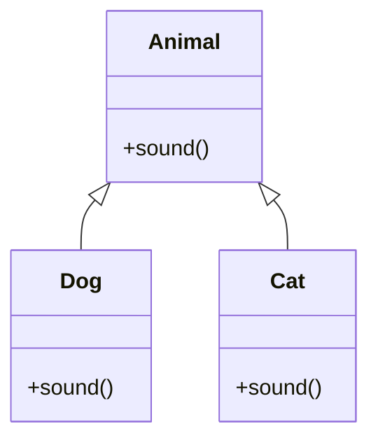

# 🔄 Polymorphism in Java

---

## 📖 Introduction

**Polymorphism** is an **OOP concept** that allows objects to take **many forms**.
It enables a single **method or object** to behave differently based on context.

**Types of Polymorphism in Java:**

1. **Compile-time Polymorphism** (Static Polymorphism)

   * Achieved using **method overloading** or **constructor overloading**.
   * Resolved during **compile time**.

2. **Runtime Polymorphism** (Dynamic Polymorphism)

   * Achieved using **method overriding**.
   * Resolved during **runtime**.

---

## ✅ Key Points

* **Compile-time polymorphism:** same method name, different parameters.
* **Runtime polymorphism:** subclass provides its own implementation of a method from superclass.
* **Upcasting:** assigning a subclass object to a superclass reference.

  * Used for **runtime polymorphism**.
  * Allows calling overridden methods based on **actual object type**.

---

## 🖼 Diagram: Polymorphism (Runtime & Upcasting)



* **Upcasting Example:**

  ```java
  Animal a1 = new Dog(); // Upcasting
  Animal a2 = new Cat(); // Upcasting
  ```
* **Method called is based on actual object type**, not reference type.

---

## 📝 Example: Compile-time Polymorphism (Method Overloading)

```java
class Calculator {
    int add(int a, int b) {
        return a + b;
    }

    int add(int a, int b, int c) {
        return a + b + c;
    }

    double add(double a, double b) {
        return a + b;
    }
}

public class CompileTimeDemo {
    public static void main(String[] args) {
        Calculator calc = new Calculator();
        System.out.println(calc.add(10, 20));
        System.out.println(calc.add(10, 20, 30));
        System.out.println(calc.add(5.5, 6.5));
    }
}
```

---

## 🎯 Output (Compile-time Polymorphism)

```
30
60
12.0
```

---

## 📝 Example: Runtime Polymorphism (Method Overriding & Upcasting)

```java
class Animal {
    void sound() {
        System.out.println("Animal makes a sound");
    }
}

class Dog extends Animal {
    @Override
    void sound() {
        System.out.println("Dog barks");
    }
}

class Cat extends Animal {
    @Override
    void sound() {
        System.out.println("Cat meows");
    }
}

public class RuntimeDemo {
    public static void main(String[] args) {
        Animal a;

        a = new Dog(); // Upcasting
        a.sound();     // Dog's version

        a = new Cat(); // Upcasting
        a.sound();     // Cat's version
    }
}
```

---

## 🎯 Output (Runtime Polymorphism)

```
Dog barks
Cat meows
```

---

## 🔑 Why Use Polymorphism?

* **Code reusability:** same method works with different data types or objects.
* **Improves flexibility:** one interface, multiple implementations.
* **Supports runtime decision making:** overridden methods executed based on object type.

---

## ⚠️ Important Notes

* **Compile-time polymorphism:** resolved by the compiler, achieved via method/constructor overloading.
* **Runtime polymorphism:** resolved at runtime, achieved via method overriding.
* **Upcasting:** allows treating subclass objects as superclass type for runtime polymorphism.
* Private methods **cannot be overridden**.

---

## 💡 Interview Questions

**1. What is polymorphism in Java?**
Polymorphism allows objects or methods to take **multiple forms**, enabling **dynamic or static behavior**.

**2. What are the types of polymorphism in Java?**

* Compile-time (method/constructor overloading)
* Runtime (method overriding)

**3. What is compile-time polymorphism?**
Achieved via **method overloading** or **constructor overloading**; resolved by **compiler**.

**4. What is runtime polymorphism?**
Achieved via **method overriding**; resolved at **runtime** depending on the actual object.

**5. What is upcasting?**
Assigning a **subclass object** to a **superclass reference**. It is used for **runtime polymorphism**.

**6. Can private methods be overridden?**
❌ No, private methods cannot be overridden because they are **not visible to subclasses**.

**7. Difference between compile-time and runtime polymorphism:**

| Feature     | Compile-time                                      | Runtime                         |
| ----------- | ------------------------------------------------- | ------------------------------- |
| Achieved by | Method/Constructor Overloading                    | Method Overriding               |
| Resolved at | Compile-time                                      | Runtime                         |
| Example     | `add(int a, int b)` vs `add(int a, int b, int c)` | `Dog` overrides `Animal` method |
