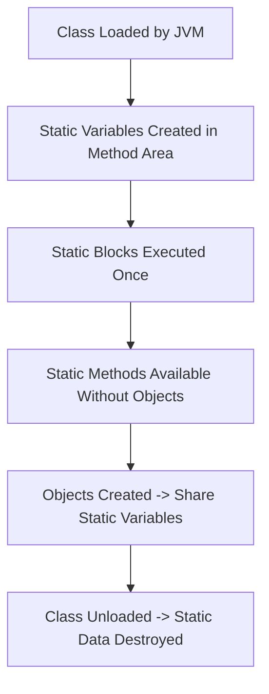

# ⚡ Mastering `static` in Java

---

## 📖 Introduction
The **`static` keyword** in Java is used for **class-level members**.  
- Belongs to the **class**, not to individual objects.  
- Shared among all instances.  
- Loaded once when the class is loaded into memory.

---

## 🔑 Static Variables (Class Variables)

### ✅ Definition
- Declared with the `static` keyword inside a class.  
- Memory allocated **only once**, when the class is loaded.  
- Shared by **all objects** of the class.

### 📌 Example
```java
class Counter {
    static int count = 0; // static variable

    Counter() {
        count++;
        System.out.println("Count: " + count);
    }
}

public class Test {
    public static void main(String[] args) {
        new Counter(); // Count: 1
        new Counter(); // Count: 2
        new Counter(); // Count: 3
    }
}
````

🔎 Here `count` is **shared across all objects**.

---

## 🔑 Static Methods

### ✅ Definition

* Declared with the `static` keyword.
* Can be called without creating an object of the class.

### 📌 Example

```java
class MathUtils {
    static int square(int n) {
        return n * n;
    }
}

public class Test {
    public static void main(String[] args) {
        System.out.println(MathUtils.square(5)); // 25
    }
}
```

### 📝 Rules

1. Can **only access static data** directly.
2. Cannot use `this` or `super`.
3. Used for **utility/helper methods** (e.g., `Math.max()`).

---

## 🔑 Static Blocks

### ✅ Definition

* A block of code with `static { }`.
* Runs **only once**, when the class is loaded.
* Used for **class-level initialization**.

### 📌 Example

```java
class Database {
    static String connection;

    static {
        System.out.println("Loading database config...");
        connection = "MySQL Connected";
    }
}

public class Test {
    public static void main(String[] args) {
        System.out.println(Database.connection);
    }
}
```

📌 Output:

```
Loading database config...
MySQL Connected
```

---

## 🔑 Static Nested Classes

* A **class declared as `static` inside another class**.
* Can access only **static members** of the outer class.

```java
class Outer {
    static int data = 100;

    static class Inner {
        void msg() {
            System.out.println("Data: " + data);
        }
    }
}

public class Test {
    public static void main(String[] args) {
        Outer.Inner obj = new Outer.Inner();
        obj.msg(); // Data: 100
    }
}
```

---

## 🗂️ Memory & Lifecycle of `static`



📌 Explanation:

* When a **class is loaded**, static variables & blocks are executed.
* Static methods can be accessed without objects.
* All objects **share static variables**.
* When the class is unloaded → static data is cleared.

---

## 🎯 Real-World Examples of `static`

1. **`main` method**

   ```java
   public static void main(String[] args) { ... }
   ```

   * Must be `static` so JVM can call it **without creating an object**.

2. **Utility Classes**

   * `Math` class in Java → all methods are `static`.

3. **Singleton Pattern**

   * Use `static` variables to store the single instance.

---

## 📝 Best Practices

* Use `static` for **constants** (`static final`).
* Use `static` for **utility methods** (Math, Arrays, Collections).
* Avoid **overusing** `static` → it reduces flexibility & testability.
* Don’t store state in static variables unless it’s truly **global/shared**.

---

## 🎯 Interview Q\&A

**Q1. Why is `main` method static in Java?**

**A1.** Because JVM needs to call it without creating an object.

---

**Q2. Can a static method access non-static variables?**

**A2.** No, because non-static variables belong to objects, which may not exist.

---

**Q3. When is a static block executed?**

**A3.** Once, when the class is loaded into memory.

---

**Q4. Can we override static methods?**

**A4.** No, static methods are **class-level**, not object-level.

* If a subclass defines a static method with the same signature → it’s **method hiding**, not overriding.

---

**Q5. Where are static variables stored in memory?**

**A5.** In the **Method Area (Class Area)** of JVM memory.

---


# 🧩 Tricky Interview Questions on `static` in Java

---

## ❓ Q1. What will be the output?
```java
class Test {
    static int count = 0;

    Test() {
        count++;
    }

    public static void main(String[] args) {
        Test t1 = new Test();
        Test t2 = new Test();
        Test t3 = new Test();
        System.out.println(Test.count);
    }
}
````

### ✅ Answer:

```
3
```

📌 Because `count` is **shared** among all objects and increments with each constructor call.

---

## ❓ Q2. What will this print?

```java
class Test {
    static {
        System.out.println("Static Block Executed");
    }

    public static void main(String[] args) {
        System.out.println("Main Method Executed");
    }
}
```

### ✅ Answer:

```
Static Block Executed
Main Method Executed
```

📌 Static block executes **once** when the class is loaded → before `main`.

---

## ❓ Q3. Can we overload and override static methods?

```java
class Parent {
    static void show() {
        System.out.println("Parent");
    }
}

class Child extends Parent {
    static void show() {
        System.out.println("Child");
    }
}
```

```java
public class Test {
    public static void main(String[] args) {
        Parent p = new Child();
        p.show();
    }
}
```

### ✅ Answer:

```
Parent
```

📌 Static methods are **not overridden**, they are **hidden** (resolved at compile time, not runtime).

---

## ❓ Q4. Multiple Static Blocks

```java
class Test {
    static {
        System.out.println("Block 1");
    }

    static {
        System.out.println("Block 2");
    }

    public static void main(String[] args) {
        System.out.println("Main");
    }
}
```

### ✅ Answer:

```
Block 1
Block 2
Main
```

📌 Static blocks run **in the order they appear** in the class, before `main`.

---

## ❓ Q5. Static Variables in Inheritance

```java
class Parent {
    static int x = 10;
}

class Child extends Parent {
    static int x = 20;
}

public class Test {
    public static void main(String[] args) {
        System.out.println(Parent.x);
        System.out.println(Child.x);
    }
}
```

### ✅ Answer:

```
10
20
```

📌 Static variables are **not inherited** like instance variables.
Each class has its own copy.

---

## ❓ Q6. Trick with Object References

```java
class Test {
    static int count = 0;

    Test() {
        count++;
    }

    public static void main(String[] args) {
        Test t1 = null;
        Test t2 = new Test();
        Test t3 = new Test();
        t1.count = 100;
        System.out.println(Test.count);
    }
}
```

### ✅ Answer:

```
100
```

📌 Even though `t1` is `null`, accessing `t1.count` is valid since `count` belongs to the **class**, not the object.

---

```

---


